---
title: "Homologias, Caracteres e Mensurações"
subtitle: "Modularidade: conectando padrões e processos em evolução multivariada"
author: Guilherme Garcia
date: wgar@usp.br
logo: ../../logo.png
output:
  ioslides_presentation:
    transitions: faster
    self_contained: true
    widescreen: false
    fig_caption: true
    css: extra.css
csl: /home/guilherme/Dropbox/Global/evolution.csl
bibliography: /home/guilherme/Dropbox/Global/CursoMod.bib
---	

# Objetivos {.objs}

> - Relacionar o contexto teórico de um fenômeno de interesse às formas de mensurar seus efeitos

> - Elaborar esta relação a respeito de sistemas morfológicos, seu desenvolvimento e função

## Homologias {.columns-2}
* Relações de equivalência entre atributos em espécies distintas

    > + Revelam origens evolutivas em comum

	> + Vias de desenvolvimento compartilhadas

    > + Relação global entre atributos

 

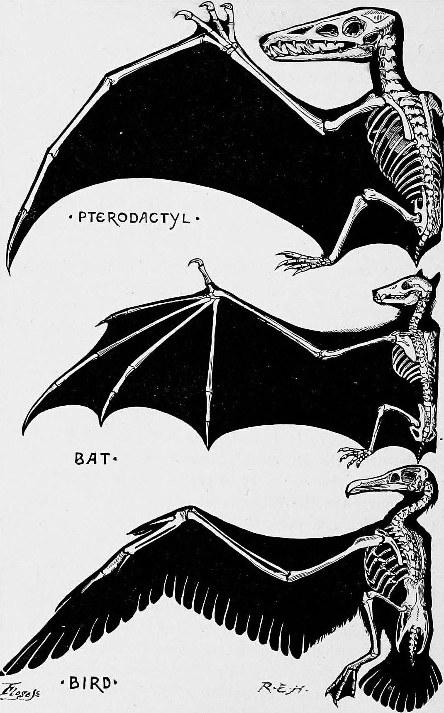

## Um exemplo mais extremo {.centered}
![[@tulenko_hoxd_2016]](Figures/forelimb_phylo.png)

## {.columns-2 .smaller}

> * Desenvolvimento dos elementos ósseos determinado pela expressão dos mesmos *loci* nas três linhagens

&nbsp;

> * Elementos ósseos adicionais nas linhagens derivadas regulados pelos mesmos *loci* em uma fase posterior

 

![[@yano_making_2013]](Figures/hox_homology.png)

## Homologias e Mapas Genótipo-Fenótipo {.centered}
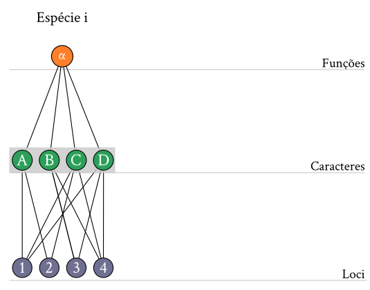

## Homologias e Mapas Genótipo-Fenótipo {.centered}
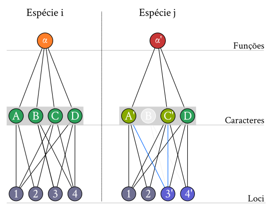

## Como reconhecer homologias? {.centered}
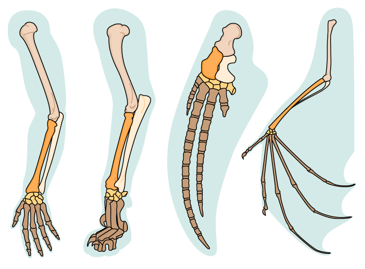

## Caráter

Conjunto de atributos *mutuamente exclusivos* identificados em um conjunto de organismos

> - *Mutuamente exclusivos*: a cada organismo atribui-se apenas um estado do caráter

## Exemplo: Coloração {.centered}
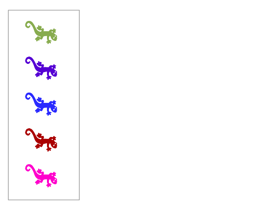

## Exemplo: Coloração {.centered}
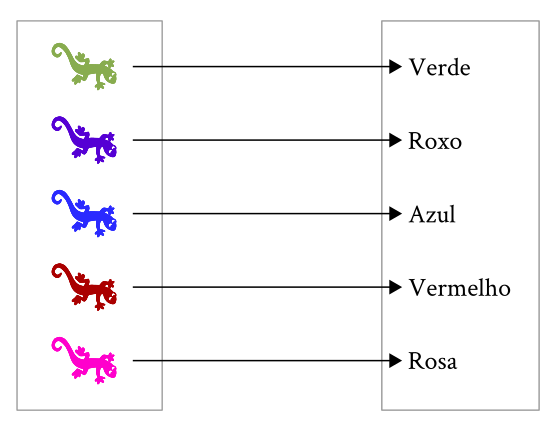

## Exemplo: Coloração {.centered}
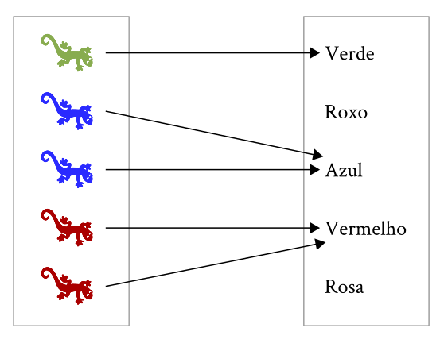

## Exemplo: Coloração {.centered}
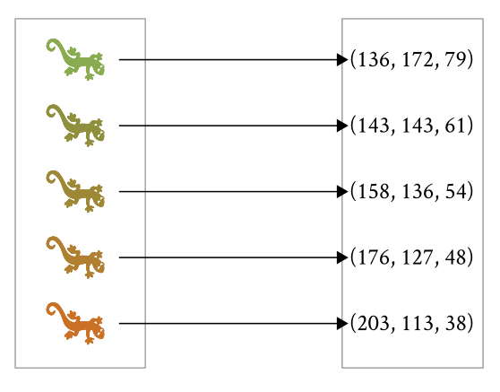

## Em princípio...

> - Homologias não aparecem nesta definição de caráter

> - Caracteres são divisões arbitrárias que somos capazes de reconhecer em organismos ou suas partes

> - O uso de um conjunto particular de caracteres se justifica com base no contexto teórico de referência

## {.centered .smaller}
![[@levins_dialectical_1985; @houle_measurement_2011]](Figures/dial_1.png)

## {.centered .smaller}
![[@levins_dialectical_1985; @houle_measurement_2011]](Figures/dial_2.png)

## {.centered .smaller}
![[@levins_dialectical_1985; @houle_measurement_2011]](Figures/dial_3.png)

## {.centered .smaller}
![[@levins_dialectical_1985; @houle_measurement_2011]](Figures/dial_4.png)

## Mensuração

> - *Estrutura de relações empíricas*: objetos reais, seus atributos e o conjunto de operações sobre eles

> - *Estrutura de relações numéricas*: valores/estados dos atributos e o conjunto de operações válidas entre estes valores

> - **Mensuração**:  Relação de equivalência entre estas estruturas

## {.centered .smaller}
![[@levins_dialectical_1985; @houle_measurement_2011]](Figures/dial_4.png) 

## {.centered .smaller}
![[@levins_dialectical_1985; @houle_measurement_2011]](Figures/dial_5.png) 

## Temperatura {.centered}
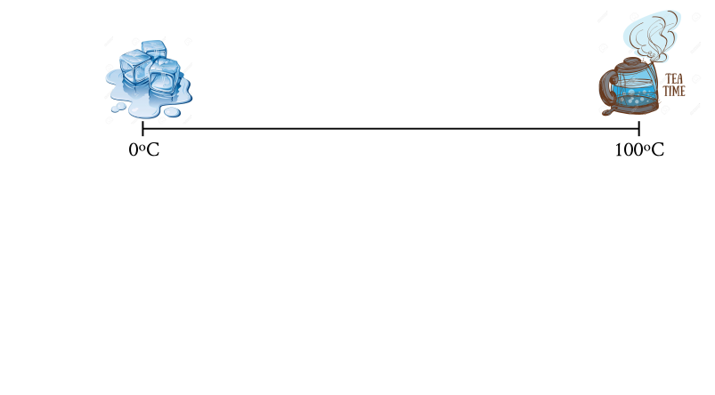

## Temperatura {.centered}
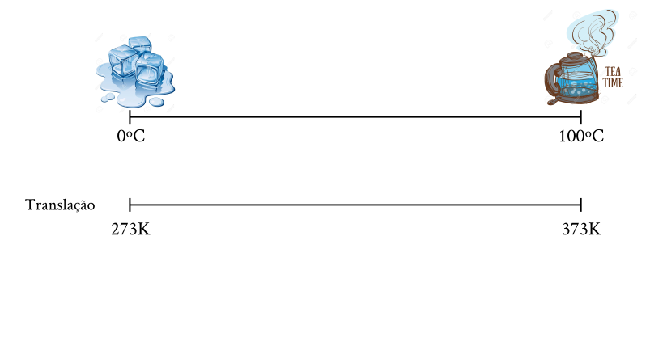

## Temperatura {.centered}
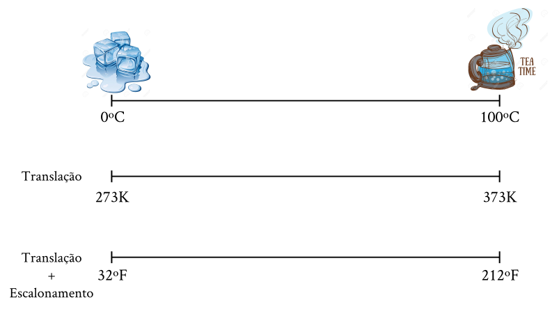

## Temperatura {.centered}
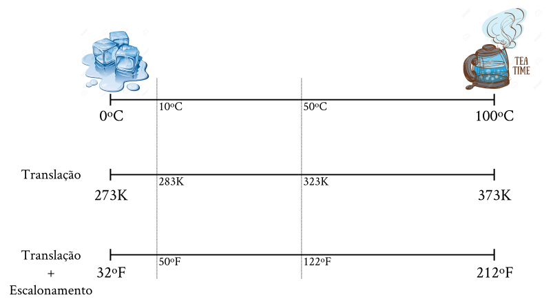

## Temperatura {.centered}

## Temperatura {.centered}
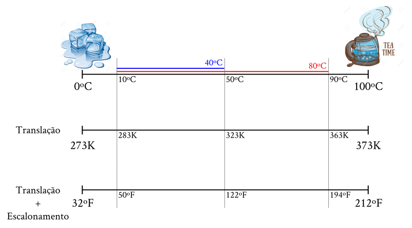

## Temperatura {.centered}
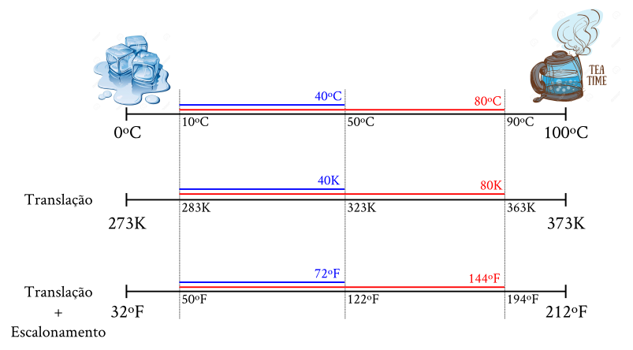

## {.centered .smaller}
![[@houle_measurement_2011]](Figures/theory_to_measurement.png)

## Tamanho e Peso {.smaller}

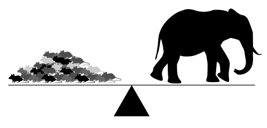

> + Comparação entre objetos permite estrutura de produto nas relações numéricas
   
> + Passível de transformação para escala log

## Medidas de referência {.centered}
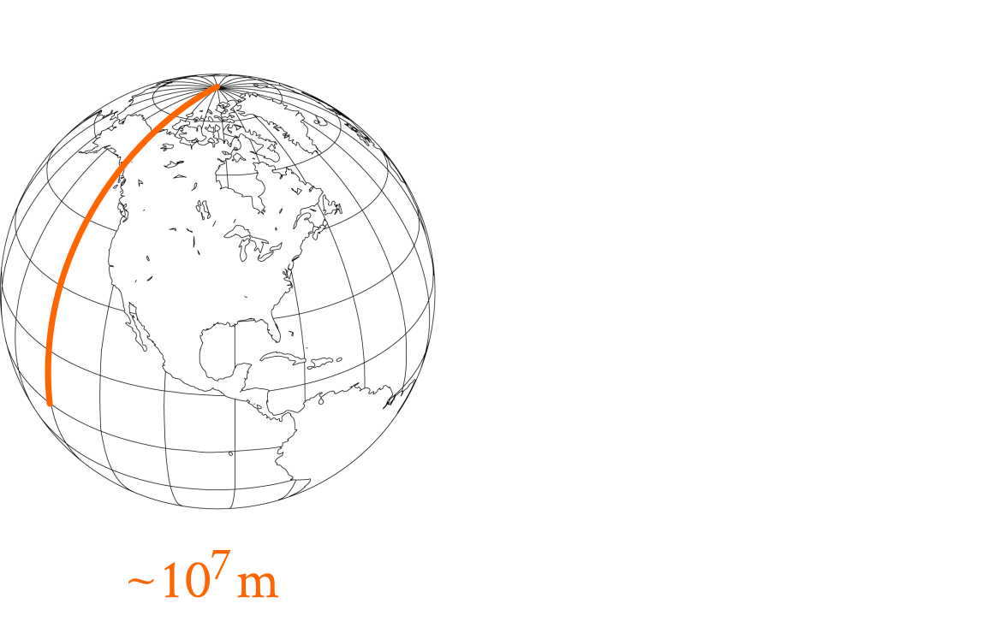

## Medidas de referência {.centered}
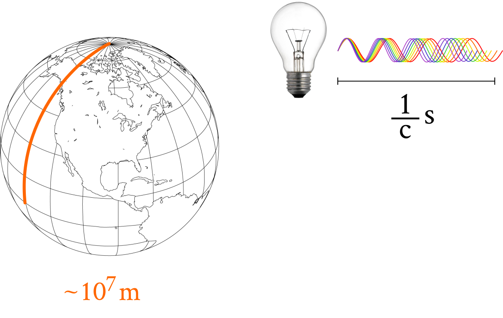

## Medidas de referência {.centered}
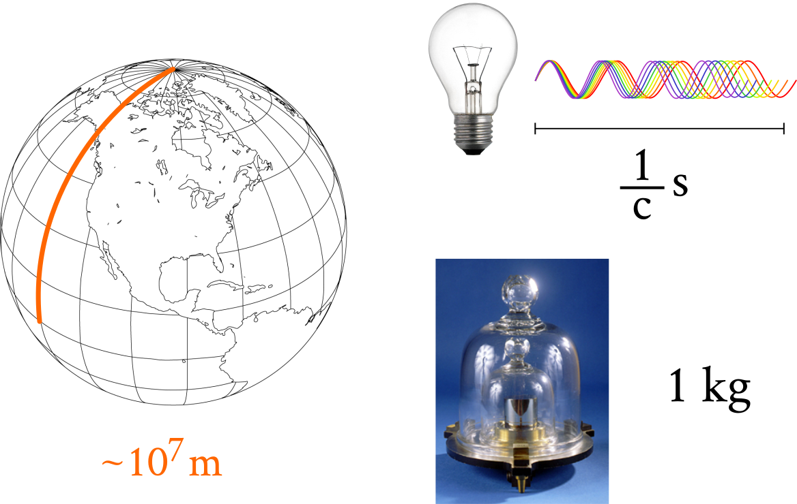

## {.centered .smaller}
![[@houle_measurement_2011]](Figures/theory_to_measurement.png)

## Medidas Pragmáticas

- Como mensurar atratividade?

- Poderíamos fazer um experimento:

## Medidas Pragmáticas

- Como mensurar atratividade?

- Poderíamos fazer um experimento:

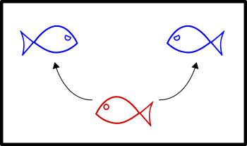

## Medidas Pragmáticas

> - Algumas mensurações apenas aproximam o fenômeno de interesse

> - Aptidão, este atributo elusivo...

> - Nunca se esqueça da distinção entre o fenômeno de interesse e a forma que você usa para representá-lo

## Porque medir caracteres homólogos? {.centered}

## Quando não medir caracteres homólogos? {.centered}
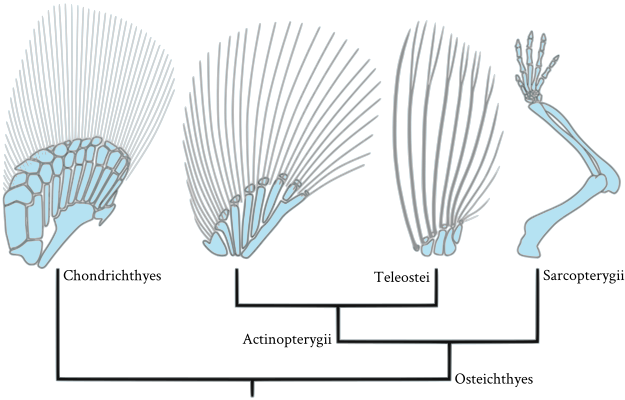

## Quando não medir caracteres homólogos? {.centered}
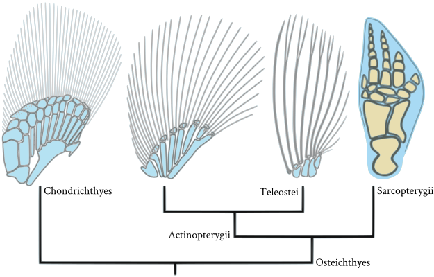

## Uma Situação Ideal {.centered .smaller}
![[@young_development_2010]](Figures/limb_struct.png)

# Morfometria {.objs}

- *Landmarks*

- Morfometria Tradicional e Geométrica

- Deformações

## *Landmarks*

> * Reduzir as relações de homologia entre partes

> * Relações de homologias entre pontos [@bookstein_morphometric_1991]

* Tipos de Landmarks

     + Justaposição de tecidos
	 
     + Máximos de curvaturas locais
	 
     + Máximos de curvaturas globais / outros

## {.centered}
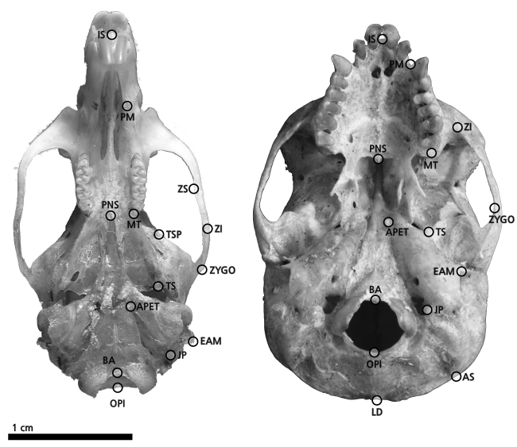

## Distâncias Lineares {.centered}
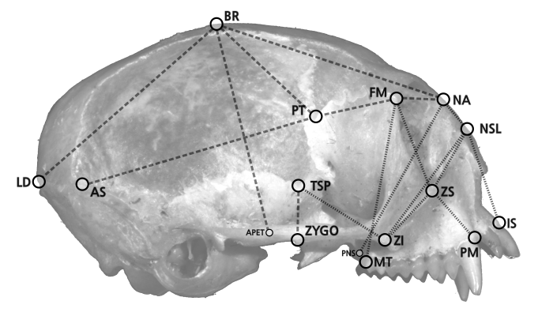

## Coordenadas Cartesianas {.centered}

## Análise Generalizada de Procrustes {.centered}
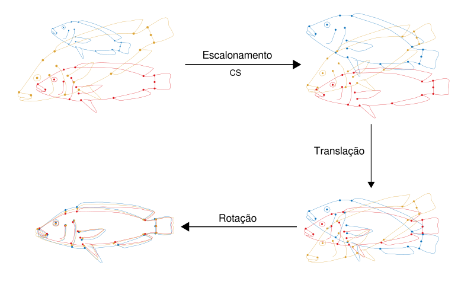

## Deformações {.centered .columns-2}

![[@thompson_growth_1917]](Figures/growth.jpg)

 

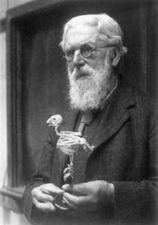

## Deformações {.columns-2}

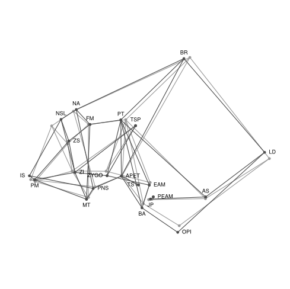

 

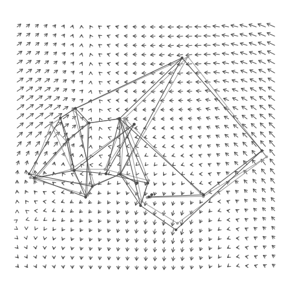

## Bibliografia {.bibs}
