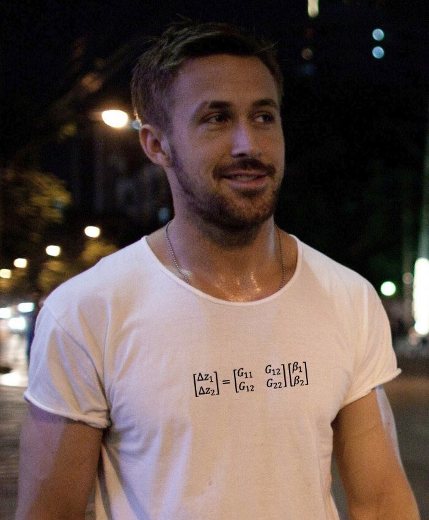

```{r setup, include=FALSE}
knitr::opts_chunk$set(echo = TRUE)
```

# Equação do criador

Para entender a equação de resposta à seleção, vamos lembrar da herdabilidade (relacionada com a covariância entre pais e filhos). Pense que temos uma população expressando um caráter quantitativo qualquer com herdabilidade ($h^2$) de 0.6. Isso significa que nessa população, se fizermos uma gráfico com a média do valor do caráter nos pais no eixo $x$ e o valor do caráter dos filhos no eixo $y$, centralizando o grafico na média dos pais, teriamos alguma coisa assim:

```{r, echo = FALSE}
library(mvtnorm)
library(ggplot2)
set.seed(42)
x = rnorm(100, 0, 1)
y = 0.6 * x + rnorm(100, 0, 0.3)
data = as.data.frame(scale(data.frame(x, y), scale = FALSE))
model = lm(data$y ~ data$x)
c = coef(model)
ggplot(data, aes(x, y)) + geom_point() + theme_bw() + coord_fixed() + labs(x = "Fenótipo dos pais", y = "Fenótipo dos filhos") + geom_hline(yintercept = 0) + geom_vline(xintercept = 0)
```

Nesta população, vamos aplicar um regime de seleção direcional no fenótipo dos pais. Apenas pais com fenótipo uma unidade maior que a média irão deixar descendentes. Vamos usar o gráfico para descobrir a nova média dos filhos:

```{r, echo = FALSE}
x_mean = mean(data[data$x > 1, "x"])
y_mean = mean(data[data$x > 1, "y"])
shade <- data.frame(x = c(1, 1, 2.5, 2.5, 1), y = c(-2, 2, 2, -2, -2))
ggplot(data, aes(x, y)) + geom_polygon(data = shade, aes(x, y), fill = "lightblue", alpha = 0.5) + geom_point() + theme_bw() + coord_fixed() + labs(x = "Fenótipo dos pais", y = "Fenótipo dos filhos") + geom_hline(yintercept = 0) + geom_vline(xintercept = 0) + geom_smooth(method = "lm", color = "blue", se = FALSE) + geom_segment(x = x_mean, xend=x_mean, y = 0, yend = c[2] * x_mean, linetype = "dashed", size = 2)  + geom_segment(x = 0, xend=x_mean, y = c[2] * x_mean, yend = c[2] * x_mean, linetype = "dashed", size = 2) 
```

A região em azul representa o limiar de seleção (apenas pais maiores que 1 deixam descententes). A média dos pais depois da seleção está marcada pela linha tracejada vertical. Usando uma regressão linear, podemos descobrir a média dos filhos dos pais que sobrevivem à seleção. A linha tracejada horizontal marca a média dos filhos após a seleção. O coeficiente de inclinação da regressão entre pais e filhos é a herdabilidade do caráter na população. Como nós centralizamos os pais e a reta de regressão passa pelo zero, sabemos que a média dos pais e filhos antes da seleção eram iguais. 

A diferença entre a média dos pais antes e depois da seleção é chamada de diferencial de seleção ($S$), enquanto a diferença na média dos filhos é chamada de resposta à seleção ($R$). A razão entre ela, ou o coeficiente da inclinação da reta de regressão entre pais e filhos, ou a tangente do angulo da reta, é a herdabilidade ($h^2$). Graficamente:

```{r, echo = FALSE}
S = data.frame(x = c(0, 0, x_mean, x_mean),
               y = c(0, - 0.1, - 0.1, 0))

R = data.frame(x = c(-0.1, -0.1, 0),
               y = c(0, c[2] * x_mean, c[2] * x_mean))

ggplot(data, aes(x, y)) + geom_polygon(data = shade, aes(x, y), fill = "lightblue", alpha = 0.5) + geom_point(alpha = 0.3) + theme_bw() + coord_fixed() + labs(x = "Fenótipo dos pais", y = "Fenótipo dos filhos") + geom_hline(yintercept = 0) + geom_vline(xintercept = 0) + geom_smooth(method = "lm", color = "blue", se = FALSE) + geom_segment(x = x_mean, xend=x_mean, y = 0, yend = c[2] * x_mean, linetype = "dashed", size = 2)  + geom_segment(x = 0, xend=x_mean, y = c[2] * x_mean, yend = c[2] * x_mean, linetype = "dashed", size = 2) + geom_line(data = S, color = "red") + annotate("text", x = 0.7, y = -0.2, label = "S", size = 5) + geom_line(data = R, color = "red") + annotate("text", x = -0.2, y = 0.45, label = "R", size = 5) + geom_segment(x = -0.1, xend = 0, y = 0, yend = 0, color = "red")
```

Juntando tudo isso, podemos escrever a equação do criador:

$$
R = h^2S
$$

Ou seja, a resposta à seleção direcional é uma combinação entre a intensidade de seleção (quanto maior o $S$ maior a intensidade de seleção) e a variação disponível que é herdável (a herdabilidade, a regressão entre pais e filhos). Nesse caso, temos $S = 1.44$, $h^2 = 0.6$ e, portanto, $R = 0.87$. 

Em condições razoáveis, o coeficiente da regressão entre pais e filhos vai ser igual à razão entre a variância nos valores de acasalamento dos pais (variancia aditiva, $V_a$) e a variância fenotípica total ($V_p$). Por isso, é comum encontrarmos a equação do criador escrita como $R = \frac{V_a}{V_p}S$ nos livros texto. A formulação como a regressão entre pais e filhos é mais geral, e a versão usando a partição de variâncias é mais fácil de ser mensurada.

# Equação de Lande

O que acontece quando temos mais de um caráter no sistema? Para entender o problema, pense que estamos olhando para dois caracteres nos pais, e aplicando seleção em apenas um deles. Imagine que esses dois caracteres tenham uma correlação fenotípica de 0.8 entre eles:

```{r, echo = FALSE}
set.seed(42)
xy = data.frame(rmvnorm(100, sigma = matrix(c(1, 0.8, 0.8, 1), 2, 2)))
names(xy) = c("x","y")
shade <- data.frame(x = c(1, 1, 2.5, 2.5, 1), y = c(-2, 2.8, 2.8, -2.5, -2.5))
ggplot(xy, aes(x, y)) + geom_polygon(data = shade, aes(x, y), fill = "lightblue", alpha = 0.5) + geom_point() + theme_bw() + coord_fixed() + labs(x = "Caráter x nos pais", y = "Caráter y nos pais") + geom_hline(yintercept = 0) + geom_vline(xintercept = 0)
```

Da mesma forma que a correlação entre pais e filhos impõem uma resposta, a correlação entre caracteres impõem um diferencial de seleção correlacionado. Então, se existe um $S_x$, a correlação entre $x$ e $y$ leva a um $S_y$:

```{r, echo = FALSE}
x_mean = mean(xy[xy$x > 1, "x"])
y_mean = mean(xy[xy$x > 1, "y"])
S_x = data.frame(x = c(0, 0, x_mean, x_mean),
               y = c(0, - 0.1, - 0.1, 0))

S_y = data.frame(x = c(-0.1, -0.1, 0),
               y = c(0, y_mean, y_mean))

ggplot(xy, aes(x, y)) + geom_polygon(data = shade, aes(x, y), fill = "lightblue", alpha = 0.5) +
  geom_point(alpha = 0.3) + theme_bw() + coord_fixed() + 
  labs(x = "Caráter x nos pais", y = "Caráter y nos pais") + 
  geom_hline(yintercept = 0) + geom_vline(xintercept = 0) + 
  geom_line(data = S_x, color = "red") + annotate("text", x = x_mean/2, y = -0.3, label = "S[x]", size = 5, parse = TRUE) + 
  geom_line(data = S_y, color = "red") + annotate("text", x = -0.3, y = y_mean/2, label = "S[y]", size = 5, parse = TRUE) + 
  geom_segment(x = -0.1, xend = 0, y = 0, yend = 0, color = "red")
```

Esse fenômeno do diferencial de seleção correlacionado complica nossa vida, afinal, como saber qual caráter está sofrendo seleção? Nesse caso, $S = [S_x, S_y] = [1.43, 1.15]$, ambos os caracteres tem médias diferentes depois da seleção. A solução é transformar os dados, colocando eles na escala da matriz de covariação fenotípica. Fazemos isso multiplicando os dados pelo inverso da matriz fenotípica, e o resultado é o seguinte:

```{r, echo = FALSE}
P = cov(xy)
xy_p = data.frame(as.matrix(xy) %*% solve(P))
xy_p = data.frame(t(apply(as.matrix(xy), 1, function(x) solve(P, x))))
names(xy_p) = c("x", "y")
xy_p$Selection = ifelse(xy$x > 1, "Survives", "Dies")
shade <- data.frame(x = c(1, 1, 2.5, 2, 1), y = c(0, 2, 3, 0, 0))
shade_p = data.frame(t(apply(as.matrix(shade), 1, function(x) solve(P, x))))
x_mean = mean(xy_p[xy$x > 1, "x"])
y_mean = mean(xy_p[xy$x > 1, "y"])
shade_p$Selection = "Survives"

ggplot(xy_p, aes(x, y)) + geom_polygon(data = shade_p, aes(x, y), fill = "lightblue", alpha = 0.5) + 
  geom_point(alpha = 0.3) + theme_bw() + coord_fixed() + 
  labs(x = "Caráter x nos pais (Escala de P)", y = "Caráter y nos pais (Escala de P)") +
  geom_hline(yintercept = 0) + geom_vline(xintercept = 0) + 
  geom_line(data = S_x, color = "red") + annotate("text", x = x_mean/3, y = -0.35, label = "beta[x]", size = 5, parse = T) 
```

A região azul continua representando os indivíduos que sobrevivem à seleção. Mas agora a diferença nas médias antes e depois da seleção só é diferente de zero no caráter $x$ (só $x$ está sobre seleção). Essas diferenças nas médias antes e depois da seleção, medidas na escala da variância fenotípica, são chamadas de gradientes de seleção ($\beta$), e já descontam o efeito das correlações fenotípicas. Olhando para o $\beta$, que nesse caso é o vetor $\beta = [\beta_x, \beta_y] = [1.5, 0]$, sabemos que só o caráter $x$ está sofrendo seleção direcional.

Se vai haver resposta correlacionada do caráter $y$ na próxima geração depende de se os dois caracteres são correlacionados genéticamente. Um jeito de entender isso é pensar que para que haja resposta em $y$, os filhos dos pais selecionados (com $x$ acima de 1) tem que ser diferentes da média no cárater $y$. Então, a resposta depende de haver covariância entre pais e filhos para caracteres diferentes. Em condições razoáveis, a matriz de covariância genética é uma boa aproximação da covariância entre pais e filhos, e podemos prever a resposta no caráter $y$ ($\Delta z_y$) usando a matriz $G$:

$$
\Delta z_y = G_{y} \times \beta_y + G_{xy} \times \beta_{x} 
$$

Ou seja, a seleção diretamente em $y$ (dada por $\beta_y$) multiplicado pela variância genética de $y$ ($G_{y}$), mais a seleção em $x$ ($\beta_x$) multiplicado pela covariância genética entre $x$ e $y$ ($G_{xy}$). No nosso exemplo, $\beta_y = 0$ e só haverá resposta evolutiva em $y$ se $G_{xy}$ for diferente de zero. 

Da mesma forma, podemos escrever a resposta no caráter $x$:

$$
\Delta z_x = G_{x} \times \beta_x + G_{xy} \times \beta_{y} 
$$

Podemos juntar essas duas equação numa só usando uma notação vetorial:

$$
\Delta z = 
\left[
\begin{matrix}
\Delta z_x \\
\Delta z_y 
\end{matrix} \right]
= 
\left[
\begin{matrix}
G_x & G_{xy} \\
G_{xy} & G_y \\
\end{matrix} \right]
\left[
\begin{matrix}
\beta_x \\
\beta_y 
\end{matrix} \right] 
=
G\beta
$$

Essa é a equação multivariada de resposta à seleção, ou a Equação de Lande. É a equação mais cool, como podemos ver nessa foto:



Podemos escrever a resposta à seleção em função dos diferenciais de seleção, lembrando que o gradiente de seleção é o diferencial escrito na escala da P. Nesse caso, a equação fica:

$$
\Delta z = G\beta = GP^{-1}S
$$

Comparando essa equação com a equação do criador, vemos que $GP^{-1}$ é a quantidade análoga à herdabilidade para vários caracteres.

# Estimando $\beta$

Agora que sabemos o que o $\beta$ representa e como interpretar seus valores, vamos pensar na informação que normalmente temos na natureza. Nós já estimamos as matrizes de covariância e os vetores de mudança fenotípica ($\Delta z$), como podemos usar essa informação para entender o padrão de seleção natural? Como podemos estimar o $\beta$ que teria sido responsável pela mudança fenotípica observada? 

Vamos pensar no sistema de equações que escrevemos ali em cima:

$$
\begin{aligned}
\Delta z_x &= G_{x} \times \beta_x + G_{xy} \times \beta_{y} \\
\Delta z_y &= G_{y} \times \beta_y + G_{xy} \times \beta_{x} 
\end{aligned}
$$

Parece bom, se sabemos a matriz G (no nosso caso usamos a P como aproximação da G), sabemos o $\Delta z$, temos duas equações e duas incognitas, podemos achar o $\beta$. No R, um sistema de equações desse tipo pode ser resolvido usando a forma matricial

$$
\Delta z = G\beta
$$

A função solve() recebe a matriz de coeficientes G e o vetor de soluções $\Delta z$, e devolve o vetor de solução $\beta$.
Por exemplo, se $\beta = [1, 2]$  e G tem variâncias iguais a 2 e covariância 1.2, o $\Delta z$ esperado é:

```{r}
beta = c(1, 2)
G = matrix(c(2, 1.2,
             1.2, 2), 2, 2)
G %*% beta
```

Então, se estamos medindo uma população, e observamos um $\Delta z = [4.4, 5.2]$ e uma matriz G com variâncias 2 e covariância 1.2, podemos calcular beta usando a equação:

$$
\begin{aligned}
2 \times \beta_x + 1.2 \times \beta_{y} &= 4.4\\
2 \times \beta_y + 1.2 \times \beta_{x} &= 5.2
\end{aligned}
$$

No R, isso seria:

```{r}
deltaZ = c(4.4, 5.2)
G = matrix(c(2, 1.2,
             1.2, 2), 2, 2)
solve(G, deltaZ)
```

Que é exatamente o $\beta$ que nós usamos no começo.

# Estimando seleção pelo fitness

Este é um tutorial levemente mais avançado que usamos num curso de genética quantitativa. Ele passa pelo básico de estimativa de seleção linear e quadratica em duas dimensõe usando um modelo linear. 

Para conseguir seguir o tutorial, primeiro baixe os seguintes arquivos:

 - [Dados fenotípicos para o tutorial](https://raw.githubusercontent.com/diogro/QGcourse/master/tutorials/volesNEW.txt)
**LEMBRE-SE DE: (1) NÃO MUDAR O NOME DO ARQUIVO E (2) DE COLOCA-LO NA PASTA DO SCRIPT!!**

Agora pode seguir para a pagina do tutorial:

- [Script do tutorial (em inglês)](https://diogro.github.io/QGcourse/tutorials/Brazil_simple_selection_analysis.html)

Se houver interesse, temos também um tutorial sobre como estimar a matriz de covariância genética nesses dados:

- [Dados sobre as relações de parentesco dos animais amostrados](https://raw.githubusercontent.com/diogro/QGcourse/master/tutorials/volesPED.txt) (necessário para estimar componentes da covariância)

- [Estimando variância genética em uma dimensão](https://diogro.github.io/QGcourse/tutorials/univariate_animal_model.html)
- [Estimando matriz de covariância genética](https://diogro.github.io/QGcourse/tutorials/bivariate_animal_model.html)
